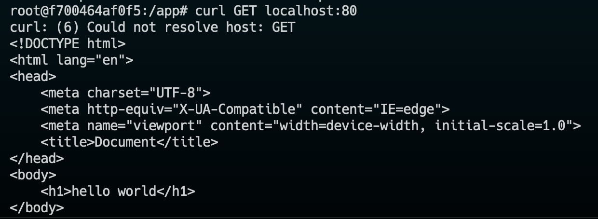
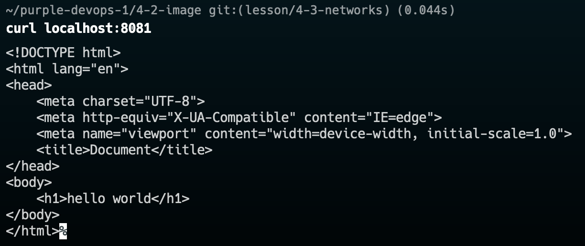

# Задание №1

### Команды для запуска

```
docker build -t my/nginx .
docker run -d --name nginx-test my/nginx
docker exec -it nginx-test bash
curl GET localhost:80
```

### Результат выполнения команд



# Задание №2

### Команды для запуска

```
docker run --name nginx-test -p 8081:80 -d my/nginx
```

### Результат выполнения команд


